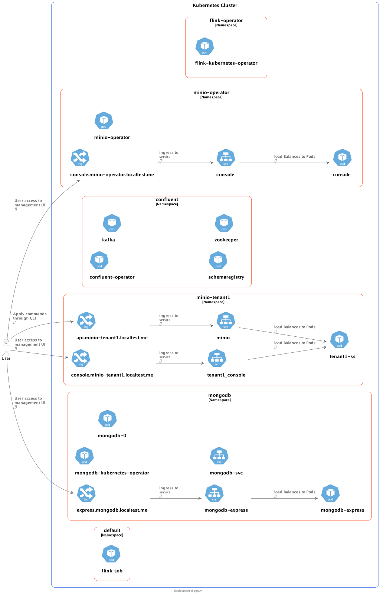

# POC Apache Flink

This POC will install a Flink on Kubernetes using
[native Kubernetes deployments](https://nightlies.apache.org/flink/flink-docs-master/docs/deployment/resource-providers/native_kubernetes/)
and
the [Flink kubernetes operator](https://nightlies.apache.org/flink/flink-kubernetes-operator-docs-main/docs/concepts/overview/),
and then deploy some simple jobs, developed in java.

## Prerequisites

* Install local Kubernetes
* Deploy Kafka
* Install Flink
* Install Minio

```shell
make setup
```

## Simple Examples

* Simple Stream Job [here](simple-stream-job/README.md)
* Simple Batch Job [here](simple-batch-job/README.md)
* Simple SQL Job (WIP) [here](simple-sql-job/README.md)
* Simple Statefun App (WIP) [here](simple-statefun-app/README.md)

## Sample Scenario Deployment diagram


