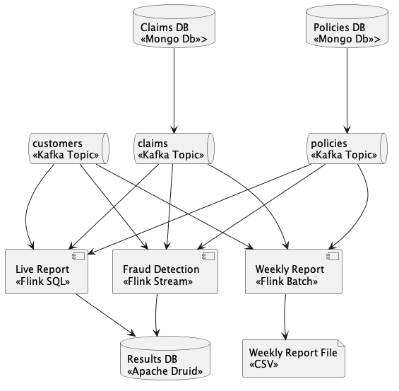

# Sample Scenario

Sample scenario has the objective to test the different flink apis.




## Prerequisites

* Install KinD: [00_SETUP_LOCAL_K8S.md](../doc/00_SETUP_LOCAL_K8S.md)
* Deploy Kafka: [01_DEPLOY_KAFKA.md](../doc/01_DEPLOY_KAFKA.md)
* Install Flink: [02_INSTALL_FLINK.md](../doc/02_INSTALL_FLINK.md)

Install skaffold
```shell
brew install skaffold
# v2.9.0
```

Create initial environment

```shell
env/setup-environment.sh
```
This command creates the following elements:
* Claims DB: \<\<Mongo DB>>
* Policies DB: \<\<Mongo DB>>

## Build & Run

The projecto consists on the following modules that will be automatically installed by `skaffold`:
* [Datagen](datagen/README.md)


```shell
skaffold dev -v trace

echo "See: http://datagen.default.localtest.me/"

kubectl logs -f deploy/datagen

# check images registered in registry
curl -X GET http://localhost:5001/v2/_catalog
curl -X GET http://localhost:5001/v2/samplescenariodatagen/tags/list
```

## Data gen

Produces data to `Policies DB`, `Claims DB` and `customers` topic  

## Live report

Run a query on `policies`, `claims` and `customers` topics and saves the result in `Results DB`.

Debug
```shell
export POD_NAME="`kubectl get pods -l app=live-report -l component=jobmanager -o custom-columns=":metadata.name" | tail -n1`";

kubectl exec --stdin --tty \
${POD_NAME} \
-- /bin/bash;

kubectl exec --stdin --tty \
${POD_NAME} \
-- curl http://schemaregistry.confluent:8081

```