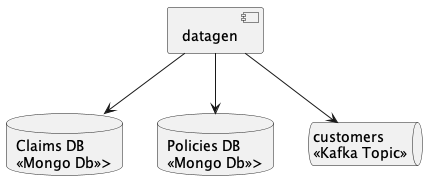

# Sample Scenario - datagen

Datagen generates consistent random data in the claims database, policies database and customers topic


## :computer: Build

Maven build

```shell
./mvnw clean package
```

## :running_man: Run locally (development purposes)

Environment variables

| Property                         | Description                         | Default Value         |
|----------------------------------|-------------------------------------|-----------------------|
| CLAIMS_DB_HOST                   | MongoDB Host                        | localhost             |
| CLAIMS_DB_PORT                   | MongoDB Port                        | 27017                 |
| CLAIMS_DB_DATABASE               | MongoDB Database name               | db                    |
| CLAIMS_DB_AUTH_DATABASE          | MongoDB Auth Database name          | admin                 |
| CLAIMS_DB_USERNAME               | MongoDB Username                    | user                  |
| CLAIMS_DB_PASSWORD               | MongoDB Password                    | password              |
| POLICIES_DB_HOST                 | MongoDB Host                        | localhost             |
| POLICIES_DB_PORT                 | MongoDB Port                        | 27017                 |
| POLICIES_DB_DATABASE             | MongoDB Database name               | db                    |
| POLICIES_DB_AUTH_DATABASE        | MongoDB Auth Database name          | admin                 |
| POLICIES_DB_USERNAME             | MongoDB Username                    | user                  |
| POLICIES_DB_PASSWORD             | MongoDB Password                    | password              |
| KAFKA_BOOTSTRAP_SERVERS          | Bootstrap servers                   | localhost:9092        |
| KAFKA_SCHEMA_REGISTRY            | Schema registry url                 | http://localhost:8081 |
| KAFKA_CUSTOMERS_TOPIC_NAME       | Topic where consumers are published | customers             |
| KAFKA_CUSTOMERS_TOPIC_PARTITIONS | Topic partitions                    | 1                     |
| KAFKA_CUSTOMERS_TOPIC_REPLICAS   | Topic replicas                      | 1                     |

Maven run

```shell
docker compose up -d

./mvnw clean spring-boot:run

docker exec -it broker kafka-console-consumer \
--property print.key=true --property key.separator="= " \
--bootstrap-server localhost:9092 \
--topic customers
```
