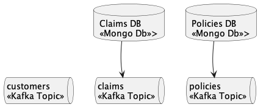

# Sample Scenario - env

Creates the following elements:
* Claims DB: \<\<Mongo DB>>
* Policies DB: \<\<Mongo DB>>
* customers: \<\<Kafka Topic>>
* claims: \<\<Kafka Topic>>
* policies: \<\<Kafka Topic>>

